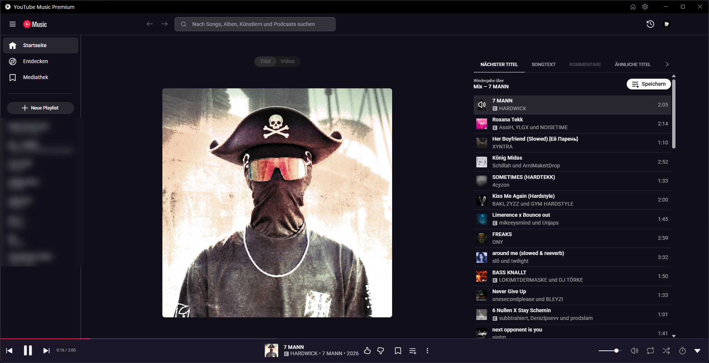

<div align="center">


# YouTube Music Premium

**A desktop client for YouTube Music.**
Built-in themes, synced lyrics, audio output device selection and a configurable Discord presence.




</div>

## What this is

YouTube Music in its own window, with global shortcuts, a tray icon and Discord rich presence — plus a few things the browser doesn't give you.

## Features

### Built-in themes

Three ready-made colour schemes: **Midnight**, **Ocean** and **Forest**. They override YouTube Music's own colour variables rather than painting over individual containers, so the whole interface stays consistent — including the spot where YouTube Music otherwise repeats its header gradient as visible stripes.

Found under **Settings → Appearance → Theme**. Custom CSS still works on top of it.

### Synced lyrics

The lyrics tab follows along with the song:

- the current line is highlighted and the text scrolls along
- clicking a line jumps to that point in the song
- scrolling yourself pauses the auto scroll and a button brings you back to the current line
- **font size** and **timing offset** are adjustable and apply instantly

The data comes from YouTube itself, the same source the mobile app uses. Songs without synced lyrics and music videos keep YouTube Music's plain lyrics.

### Audio output device

Send the app's audio to a specific device, independent of the Windows default. Handy for headphones, virtual cables or a second interface.

Found under **Settings → Playback → Audio output device**.

### Discord presence, your way

- set your **own Discord application ID**, so the status shows a name you picked, for example "Listening to YouTube Music Premium"
- a **"Listen on YouTube Music"** button that works for friends without the app installed
- no more duplicated title for singles whose album has the same name as the song

### Smaller fixes

- the expanded search box no longer covers the back and forward arrows
- the view is revealed only once YouTube Music has finished rendering, instead of flashing unstyled text in the corner
- own name, own icon and own installation folder

Also on board: companion server, Last.fm scrobbling, custom CSS, global shortcuts, tray controls and taskbar progress.

## Settings at a glance

| Setting | Where | Default |
| --- | --- | --- |
| Theme | Appearance | YouTube Music default |
| Synced lyrics | Playback | on |
| Lyrics font size | Playback | 24 px |
| Lyrics offset | Playback | 0 ms |
| Audio output device | Playback | System default |
| Discord application ID | Integrations | YouTube Music Premium application |

## Install

Grab the installer from the [releases page](https://github.com/Skorbjen/youtube-music-premium/releases), or build it yourself (see below) and take it from `out/make/squirrel.windows/x64/`.

`YouTube Music Premium Quick Setup.exe` installs without asking questions and starts the app when it's done. Once releases are published, the app updates itself from this repository. Quit the app completely, including the tray icon, before installing over an existing version.

## Development

You need [Git](https://git-scm.com) and [Node.js](https://nodejs.org) (v20 or newer).

```sh
git clone https://github.com/Skorbjen/youtube-music-premium.git
cd youtube-music-premium

# Yarn ships with the project
corepack enable

yarn install
yarn start
```

Build the installer:

```sh
yarn make
```

The installer animation lives in `src/assets/installer/` and can be regenerated with `python scripts/generate-installer-image.py` (needs Pillow).

## Contributors

<table>
  <tr>
    <td align="center" width="160">
      <a href="https://github.com/Skorbjen">
        <br>
        <sub><b>Skorbjen</b></sub>
      </a>
    </td>
    <td align="center" width="160">
      <a href="https://github.com/4tjoi">
        <br>
        <sub><b>4tjoi</b></sub>
      </a>
    </td>
  </tr>
</table>

## License

Licensed under **GPL-3.0**, see [LICENSE](LICENSE). Based on [YTMDesktop](https://github.com/ytmdesktop/ytmdesktop).

Not affiliated with Google or YouTube.
