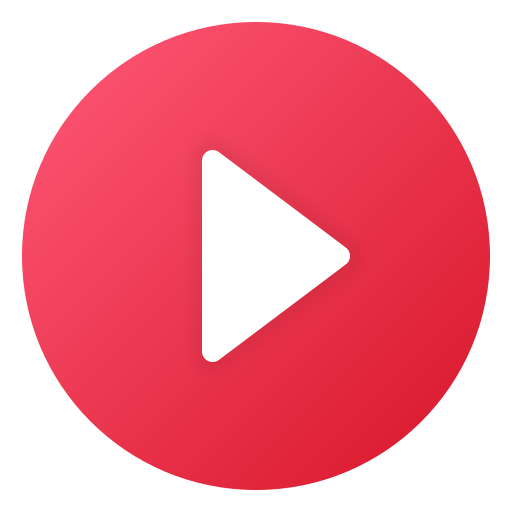
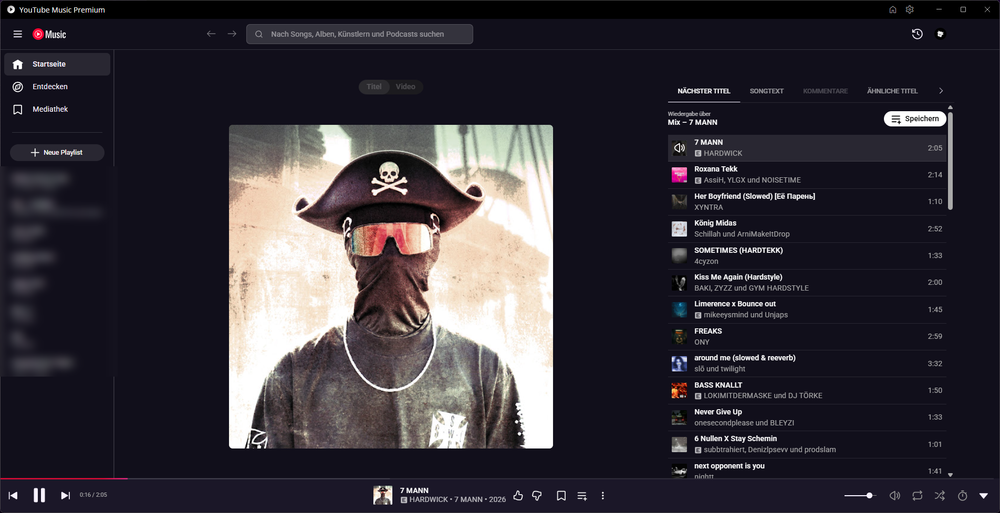

<div align="center">



# YouTube Music Premium

**A desktop client for YouTube Music.**
Mini player, equalizer, fullscreen synced lyrics, a theme that follows your music, listening stats and a command palette.




</div>

## What this is

YouTube Music in its own window, with global shortcuts, a tray icon and Discord rich presence — plus a few things the browser doesn't give you.

## Features

### Mini player

A small window with the album art, the song, a seekable progress bar, play/pause, previous, next and like. While the song has synced lyrics, the line being sung is shown underneath.

Opens from the button in the title bar, from the tray, from the command palette or with its own global shortcut. It stays on top of other windows unless you turn that off under **Settings → Appearance**.

### Equalizer and volume leveling

- ten bands from 32 Hz to 16 kHz
- presets: **Bass boost**, **Treble boost**, **Vocal**, **Rock**, **Pop**, **Electronic**, **Acoustic** and **Late night**, or drag the bands yourself
- **volume leveling** evens out quiet and loud passages and songs
- works together with the chosen audio output device

Found under **Settings → Playback**. Both are off until you switch them on.

### Fullscreen lyrics

Synced lyrics across the whole window on top of the blurred album art, with the current line highlighted. Click a line to jump there, `Esc` closes it. Opens from the lyrics button in the player bar, the tray, the command palette or a global shortcut.

### Built-in themes

Three ready-made colour schemes: **Midnight**, **Ocean** and **Forest**, plus **Dynamic**, which takes its colours from the album art of the song that is playing and fades from song to song, in YouTube Music, the title bar, the mini player and settings. They override YouTube Music's own colour variables rather than painting over individual containers, so the whole interface stays consistent — including the spot where YouTube Music otherwise repeats its header gradient as visible stripes.

Found under **Settings → Appearance → Theme**. Custom CSS still works on top of it.

### Synced lyrics

The lyrics tab follows along with the song:

- the current line is highlighted and the text scrolls along
- clicking a line jumps to that point in the song
- scrolling yourself pauses the auto scroll and a button brings you back to the current line
- **font size** and **timing offset** are adjustable and apply instantly

The data comes from YouTube itself, the same source the mobile app uses. Songs without synced lyrics and music videos keep YouTube Music's plain lyrics.

### Audio output device

Send the app's audio to a specific device, independent of the Windows default. Handy for headphones, virtual cables or a second interface.

Found under **Settings → Playback → Audio output device**. Playback pauses when the headphones or the device in use are disconnected, and optionally when the PC is locked.

### Command palette

Press `Ctrl+K` anywhere in YouTube Music: play/pause, skip, like, go to home, explore or your library, switch the theme, pick an equalizer preset, open the mini player or fullscreen lyrics, copy the song link and more. Type a few letters to filter, `Enter` runs the command. `?` lists every keyboard shortcut, including the global ones you set.

### Listening stats

Listening time today, over the last 7 days and overall, a 14 day chart, your top songs and top artists. Kept in a file on your PC only, nothing is sent anywhere. Turn it off or clear it under **Settings → Listening stats**.

### Notifications and tray

- song change notifications with the album art, "artist · album" and previous, play/pause and next buttons; they stay quiet while the app is in front
- the tray menu shows the current song and has play/pause, like, the mini player, fullscreen lyrics and **copy song link**

### Settings export

Save your settings to a file and load them again, as a backup or for another PC. Sign-ins and authorized companions are not included. Found under **Settings → Advanced**.

### Discord presence, your way

- set your **own Discord application ID**, so the status shows a name you picked, for example "Listening to YouTube Music Premium"
- a **"Listen on YouTube Music"** button that works for friends without the app installed
- no more duplicated title for singles whose album has the same name as the song

### Smaller fixes

- the expanded search box no longer covers the back and forward arrows
- the view is revealed only once YouTube Music has finished rendering, instead of flashing unstyled text in the corner
- own name, own icon and own installation folder

Also on board: companion server, Last.fm scrobbling, custom CSS, global shortcuts, tray controls and taskbar progress.

## Settings at a glance

| Setting | Where | Default |
| --- | --- | --- |
| Theme | Appearance | YouTube Music default |
| Keep the mini player on top | Appearance | on |
| Playback buttons in the notification | General | on |
| Synced lyrics | Playback | on |
| Lyrics font size | Playback | 24 px |
| Lyrics offset | Playback | 0 ms |
| Audio output device | Playback | System default |
| Pause when headphones are disconnected | Playback | on |
| Pause when the PC is locked | Playback | off |
| Equalizer | Playback | off, preset Flat |
| Volume leveling | Playback | off |
| Mini player / Fullscreen lyrics shortcut | Shortcuts | not set |
| Keep listening statistics | Listening stats | on |
| Discord application ID | Integrations | YouTube Music Premium application |

## Install

Grab the installer from the [releases page](https://github.com/v3slx/youtube-music-premium/releases), or build it yourself (see below) and take it from `out/make/squirrel.windows/x64/`.

`YouTube Music Premium Quick Setup.exe` installs without asking questions and starts the app when it's done. Once releases are published, the app updates itself from this repository. Quit the app completely, including the tray icon, before installing over an existing version.

## Development

You need [Git](https://git-scm.com) and [Node.js](https://nodejs.org) (v20 or newer).

```sh
git clone https://github.com/v3slx/youtube-music-premium.git
cd youtube-music-premium

# Yarn ships with the project
corepack enable

yarn install
yarn start
```

Build the installer:

```sh
yarn make
```

The installer animation lives in `src/assets/installer/` and can be regenerated with `python scripts/generate-installer-image.py` (needs Pillow).

## Contributors

<table>
  <tr>
    <td align="center" width="160">
      <a href="https://github.com/Skorbjen">
        <br>
        <sub><b>Skorbjen</b></sub>
      </a>
    </td>
    <td align="center" width="160">
      <a href="https://github.com/4tjoi">
        <br>
        <sub><b>4tjoi</b></sub>
      </a>
    </td>
  </tr>
</table>

## License

Licensed under **GPL-3.0**, see [LICENSE](LICENSE). Based on [YTMDesktop](https://github.com/ytmdesktop/ytmdesktop).

Not affiliated with Google or YouTube.
